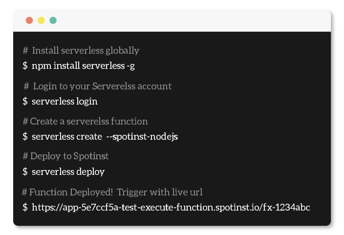

[Spotinst Functions Website](https://spotinst.com/products/spotinst-functions/) • [Spointst Community Slack](https://join.slack.com/t/spotinst-community/shared_invite/enQtMjM5MjUzMDYwMzY4LTQ4YjNkODgyNmE3MGE4ZjU3MjdmZmQ0ZTk3NTZmOTNmZmI3NjFhYjYwNzI1MzAxMzM1Yzk3NTY5MDhiN2U3Zjg) • [Spotinst Serverless Documentation](https://serverless.com/framework/docs/providers/spotinst/) • [Spoitinst Serverless Help](https://help.spotinst.com/hc/en-us/categories/115000701089-Spotinst-Functions-)

# Spotinst Serverless Examples



Here are a few examples to help you get started with Spotinst Serverless Functions

## Getting Started 

If you are new to using Spotinst Serverless Functions you can view the documentation on the [Serverless Fameworks Documentation](https://serverless.com/framework/docs/providers/spotinst/). You will need to have the serverless framework installed on your local machine as well as set up your Spotinst credentials.

## Cloning a Project

Each of the projects listed here have their own `README.md` that will help you set up each project and their use cases

**Have an example?** Fork this repository and submit a PR for review

To start any of the examples you can use any of the URLs as a template with the serverless framework. Simply type in:

```bash
serverless create --template-url <Project URL>
```

Example:

```bash
serverless create --template-url https://github.com/spotinst/spotinst-functions-examples/tree/master/node-spotinst-api-getGroups
```

<style>
.menu-group{
	display:inline-block;
}
.single-menu{
	width: 22%;
	min-height:350px;
    float:left;
    border: 2px solid black;
    border-radius: 5px;
	padding: 10px 10px;
	margin: 10px 10px;
	margin-top: 0px;
}
li{
	font-size: 16px;
}
</style>

<div class="menu-group">
	<h1>Example Functions Menu</h1>
	<div class="single-menu">
		<h3>Hello World</h3>
		<ul>
			<a href="./node-hello-world"><li>Node</li></a>
			<a href="./python-hello-world"><li>Python</li></a>
			<a href="./java8-hello-world"><li>Java8</li></a>
		</ul>
	</div>
   	<div class="single-menu">
		<h3>Languages</h3>
		<ul>
			<a href="./node"><li>Node</li></a>
			<a href="./python"><li>Python</li></a>
			<a href="./java8"><li>Java8</li></a>
		</ul>
	</div>
	<div class="single-menu">
		<h3>Spotinst Connection</h3>
			<a href="./endpoints"><li>Endpoints</li></a>
			<a href="./document-store"><li>Document Store</li></a>
			<a href="./emr"><li>EMR</li></a>
			<a href="./elastigroup"><li>Elastigroup</li></a>
	</div>
	<div class="single-menu">
		<h3>Outside Connection</h3>
			<a href="./node-twitter-vision"><li>Twitter</li></a>
			<a href="./node-lyft-webApp"><li>Lyft</li></a>
			<a href="./node-pagerduty-connection"><li>PagerDuty</li></a>
			<a href="./datadog"><li>DataDog</li></a>
	</div>
</div>
