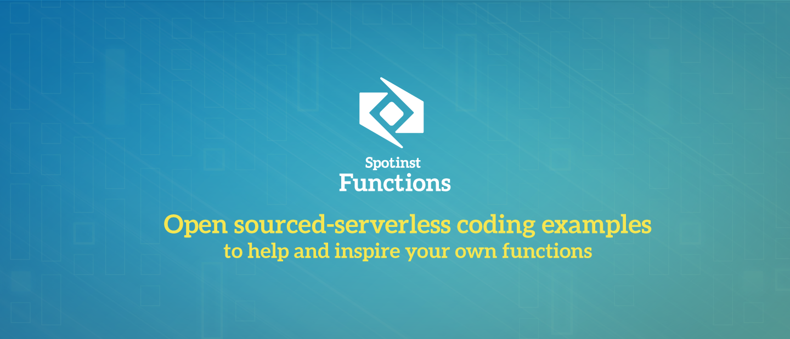

[](https://serverless.com/framework/docs/providers/spotinst/)

[Spotinst Functions Website](https://spotinst.com/products/spotinst-functions/) • [Spointst Community Slack](https://join.slack.com/t/spotinst-community/shared_invite/enQtMjM5MjUzMDYwMzY4LTQ4YjNkODgyNmE3MGE4ZjU3MjdmZmQ0ZTk3NTZmOTNmZmI3NjFhYjYwNzI1MzAxMzM1Yzk3NTY5MDhiN2U3Zjg) • [Spotinst Serverless Documentation](https://serverless.com/framework/docs/providers/spotinst/) • [Spoitinst Serverless Help](https://help.spotinst.com/hc/en-us/categories/115000701089-Spotinst-Functions-)

# Spotinst Serverless Examples


Here are a few examples to help you get started with Spotinst Serverless Functions

## Getting Started 

If you are new to using Spotinst Serverless Functions you can view the documentation on the [Serverless Fameworks Documentation](https://serverless.com/framework/docs/providers/spotinst/). You will need to have the serverless framework installed on your local machine as well as set up your Spotinst credentials.

## Examples

Each of the projects listed here have their own `README.md` that will help you set up each project and their use cases

**Have an example?** Fork this repository and submit a PR for review

To start any of the examples you can use any of the URLs as a template with the serverless framework. Simply type in:

```bash
serverless create --template-url <Project URL>
```

Example:

```bash
serverless create --template-url https://github.com/spotinst/spotinst-functions-examples/tree/master/node-spotinst-api-getGroups
```


|Spotinst Elastigroup & EMR Examples | Runtime  |
|:--------------------------- |:-----|
|[Node Spotinst Stateful Instance Pause and Resume All](./node-stateful-instance-service) </br> This example will allow you to pause and resume all your stateful insances in your account| nodeJS |
|[Node Spotinst API Get All Elastigroups](./node-spotinst-api-getGroups) </br> This example shows you how to connect to the Spotinst API and return all the Elastigroups that were created in the past hour| nodeJS |
|[Node Spotinst Scale Down Elastigroups](./node-elastigroup-scaleDown) </br> This function will allow you to connect to your Elastigroup and scale it down. This is super useful if you hook them up to a timer to auto-scale for you| nodeJS |
|[Node Spotinst Scale Up Elastigroups](./node-elastigroup-scaleUp) </br> This function will allow you to connect to your Elastigroup and scale it up. This is super useful if you hook them up to a timer to auto-scale for you| nodeJS |
|[Node Spotinst Elastigroup Set Target](./node-elastigroup-setTarget) </br> This example will allow you to connect to your Elastigroup and set the target, min and max capacity limits| nodeJS |
|[Node Spotinst API Suspend Scaling Policies](./node-spotinst-api-suspendPolicy) </br> This example shows you how to connect to the Spotinst API to suspend scaling policies on your elastigroups| nodeJS |
|[Node Spotinst API Resume Scaling Policies](./node-spotinst-api-resumePolicy) </br> This example shows you how to connect to the Spotinst API to resume scaling policies on your elastigroups| nodeJS |
|[Python Spotinst SDK Get All Elastigroups](./python-spotinst-sdk-getGroups) </br> This example shows you how to connect to the Spotinst SDK and return all the Elastigroups that were created in the past hour| Python |
|[Node Spotinst EMR Scale Down](./node-emr-scaleDown) </br> This example will allow you to connect to your EMR Elastigroup and scale it down| nodeJS |
|[Node Spotinst EMR Scale Up](./node-emr-scaleUp) </br> This example will allow you to connect to your EMR Elastigroup and scale it up| nodeJS |
|[Node Spotinst EMR Set Target](./node-emr-setTarget) </br> This example will allow you to connect to your EMR Elastigroup and set the target, min and max capacity limits| nodeJS |
|[Java8 Spotinst Elastigroup Scale Down](./java8-elastigroup-scaleDown) </br> This example will allow you to connect to your EMR Elastigroup and scale it down| Java8 |
|[Java8 Spotinst Elastigroup Scale Up](./java8-elastigroup-scaleUp) </br> This example will allow you to connect to your EMR Elastigroup and scale it up| Java8 |
|[Java8 Spotinst Elastigroup Set Target](./java8-elastigroup-setCapacity) </br> This example will allow you to connect to your EMR Elastigroup and set the target, min and max capacity limits| Java8 |
|[Java8 Spotinst API Suspend Scaling Policies](./node-spotinst-api-suspendPolicy) </br> This example shows you how to connect to the Spotinst API to suspend scaling policies on your elastigroups| nodeJS |
|[Java8 Spotinst API Resume Scaling Policies](./node-spotinst-api-resumePolicy) </br> This example shows you how to connect to the Spotinst API to resume scaling policies on your elastigroups| nodeJS |

|Spotinst Function Features Examples | Runtime  |
|:--------------------------- |:-----|
|[Node Spotinst Add Endpoint Alias](./node-endpoint-addAlias) </br> This example will create a new endpoint alias for you function environment               | nodeJS |
|[Node Spotinst Add Endpoint Pattern](./node-endpoint-addPattern) </br> This example will create an endpoint pattern that maps to a specific function        | nodeJS |
|[Node Spotinst Delete Endpoint Alias](./node-endpoint-deleteAlias) </br> This example will delete a specific endpoint alias                                 | nodeJS |
|[Node Spotinst Delete Endpoint Pattern](./node-endpoint-deletePattern) </br> This example will a specific endpoint pattern                                  | nodeJS |
|[Node Spotinst Get All Endpoint Alias](./node-endpoint-getAlias) </br> This example will return all the alias in a specific environment                     | nodeJS |
|[Node Spotinst Get All Endpoint Patterns](./node-endpoint-getPattern) </br> This example will return all the patterns in a specific environment             | nodeJS |
|[Node Spotinst Update Endpoint Pattern](./node-endpoint-updatePattern) </br> This example will allow you to update an existing endpoint pattern             | nodeJS |
|[Node Get All Values From Document Store ](./node-docstore-getAll) </br> This function will allow you to get all the key value pairs from your document store in a specific region| nodeJS |
|[Node Insert New Value Into Document Store](./node-docstore-newValue) </br> This function will allow you to insert a new value into your document store in a specific region| nodeJS |
|[Node Microservice](./node-docstore-newValue) </br> This application will allow you to create a API microservice backend with custom endpoints| nodeJS |

|External Connection Examples | Runtime  |
|:--------------------------- |:-----|
|[Node MySQL Connection](./node-mysql-connection) </br> This example shows you how to connect to a MySQL table and insert new values or return all the entries in your table| nodeJS |
|[Python MySQL Connection](./python-mysql-connection) </br> This example shows you how to connect to a MySQL table and insert new values or return all the entries in your table| Python |
|[Node Elastigroup-PagerDuty Connection](./node-pagerduty-connection) </br> You can use this function to connect your Elastigroup to PagerDuty to push notification when you launch and terminate instances as well as other supported notifications| nodeJS |
|[Python AWS Batch Queue and Elastigroup Connect](./python-aws-batch) </br> This function will check the jobs in your batch queue and either scale your Elastigroup up or down based on the requirements for the upcoming jobs| python |
|[Simple Node Chatbot](./node-simple-chatbot) </br> This example simulates a basic chat bot that allows the user to enter a message and get a pre programmed response| nodeJS |
|[Alexa Skill Running on Spotinst](./node-alexa-skill) </br> This function is an Alexa skill that runs entirly on Spotinst. It allows you to check your Elastigroups from your Alexa| nodeJS |
|[Node Raffle App](./node-raffle-app) </br> This project is a simple raffle app where users are able to enter to win and one user is randomly selected| nodeJS |
|[Node Slack Bot](./node-slack-bot) </br> This app will create a basic Slack bot that connects to your GitHub and message you once a week with a status update on your repos| nodeJS |
|[Node Elastigroup-Data Dog Metrics](./node-datadog-metric) </br> This app has two funcitons to connect your Elastigroup to Data Dog and posts Metrics to track your group| nodeJS |
|[Node Elastigroup-Data Dog Events](./node-datadog-event) </br> This app has two funcitons to connect your Elastigroup to Data Dog and posts Events to track your group| nodeJS |
|[Lyft Web App](./node-lyft-webApp) </br> This services is three functions working together to allow you to request a lyft| nodeJS |
|[Twitter Vision App](./node-twitter-vision) </br> This services is three functions working together to allow you to capture tweets that have an image and contain any word you want | nodeJS |
|[Node Static Binary (with ffmpeg)](./node-static-binary) </br> This is an example of how to use astatic binary included in your function package.           | nodeJs |
|[Node SNS Endpoint](./node-sns-endpoint) </br> This example allows you to create a SNS endpoint allowing you to have total control of the response| nodeJS |
|[Node Simple Map Reduce](./node-map-reduce) </br> This example allows you to run map reduce on a random JSON or key value pairs| nodeJS |

