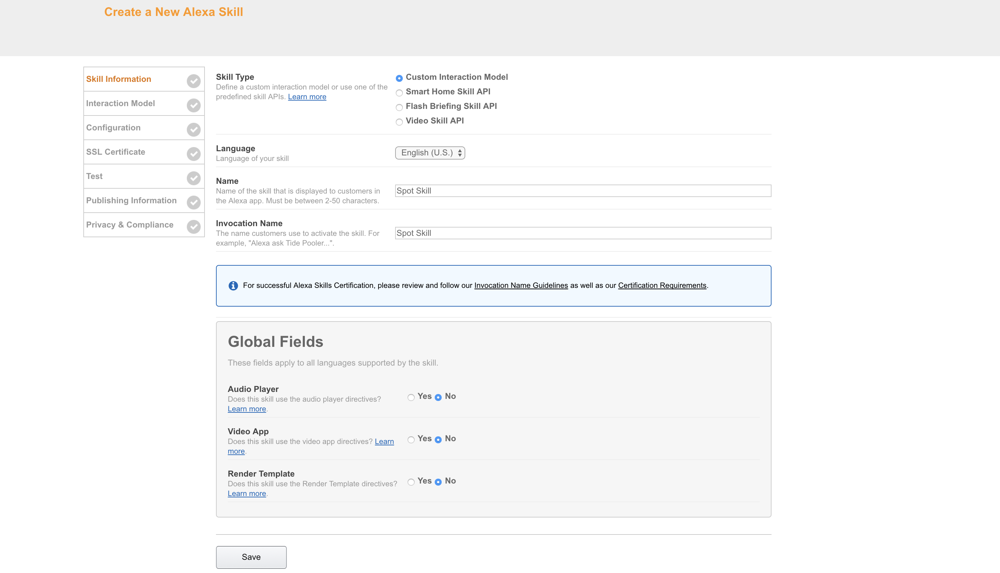
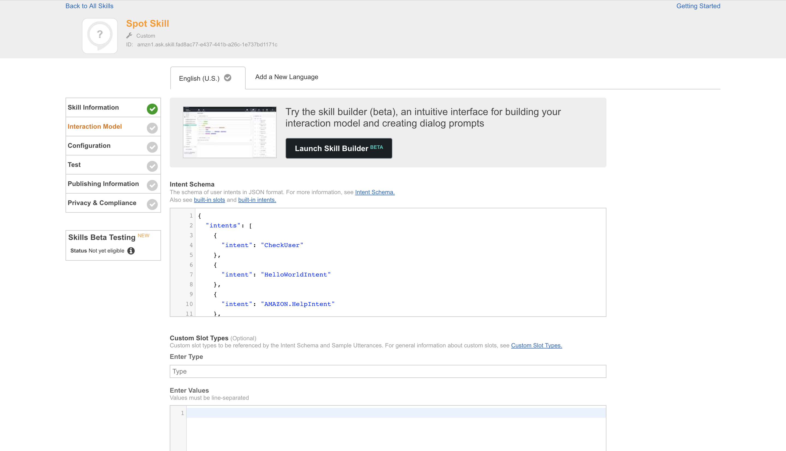
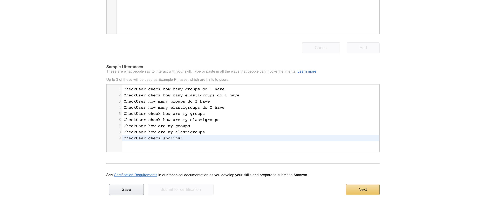
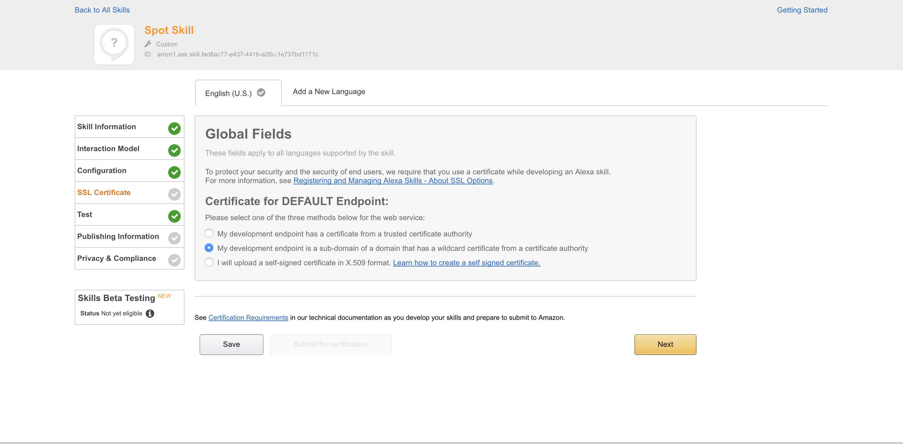

# Alexa Skill That Runs on Spotinst and Allows you to Check Your Elastigroups

This project will allow you to create an Alexa skill that runs on Spotinst. This skill will query your Spotinst account and return information about your Elastigroups

## Download

To download this project as a template for your own Spotinst Function please use this command

```bash
serverless create --template-url https://github.com/spotinst/spotinst-functions-examples/tree/master/node-alexa-skill
```

### Prerequisites

You will need to have the serverless framework installed, your Spotinst credentials set up, environment ID and account ID in order to run this project. Plus you will need to set up your Alexa Skill 

First you will want to install the serverless framework onto your local machine using the terminal command

```bash
npm install -g serverless
```

Once this has finished downloading you will have to set up your credentials to link your local machine projects to your Spotinst console. To do this please follow the directions listed [here](https://serverless.com/framework/docs/providers/spotinst/guide/credentials/).

You will also need your environment ID for your function. This can be found on the Spotinst console under the Serverless Functions tab. Select the application you wish to deploy this funciton to and locate the environment that you wish to use. Copy the environment ID and save this for later use

The last thing you will need is your account ID which can be found in the Spotinst console under user setting. Save this for later use. 

### Installing

First you will need to fork this repository and set it up on your local machine. Then you will need to install the serverless-spotinst-functions plugin the request and request promise libraries by running this command inside the project repository:

```bash
npm install
```

Once this has been completed navigate to the handler.js file and input your Spotinst Credentials. Then you will need to navigate to the serverless.yml file and under environment add in the environment ID in the environment section.

## Deployment

Next you will want to deploy this function using this command:

```bash
sls deploy
```

The first time you run this command your new function will be created and linked to your Spotinst account under the environment that you specified. You can check this on the Spotinst Functions console. Either way you should see that a unique URL is create.
**Note** Save the URL that is created here because you will need it for setting up your Alexa Skill

## Set Up Alexa Skill

For this function you will need to create a skill through the (Alexa Developer portal)[https://developer.amazon.com/edw/home.html#/ ] You will want to select "Alexa Skills Kit" then "Add New Skill". Once you are on the Create a New Alexa Skill set-up page you will first be on the Skill Information tab. Here you will want to name the Skill "Spot Skill" and set the invocation name to be the same. Once this is done find the Application ID and copy it. You will need to paste this key into your handler.js file for the variable `skillID`. When finished select Save then Next.



Next you will be under the Interaction Model tab. Here you will need to copy the contents of the file called InentSchema and paste it into the Intent Schema text box. Then you will copy the contents of sample utterances and paste them into the Sample Utterance text box. When finished select Save then Next




Next you will be under the Configuration tab. Here you will want to select the service endpoint to be HTTP. Once you select this you will see a text box appear that is labeled default. Here you will copy and paste the URL from your Spotinst function. When finished select Save then Next

Finally you will be in the SSL Certificate tab. Spotinst functions all have a protected SSL Certificate. To autenicate this you will need to select the middle option that says "My development endpoint is a sub-domain of a domain that has a wildcard certificate from a certificate authority"



Once this is completed you can check if your skill is working by inputing the sample utterances into the Testing tab. Here you should get back the information about your Elastigroup

## Using on Alexa

Once the skill is set up you can use it on your Alexa immediately. Your developer portal is linked to your Alexa so once the skill is save on the AWS console it will also be linked to your Alexa. 


