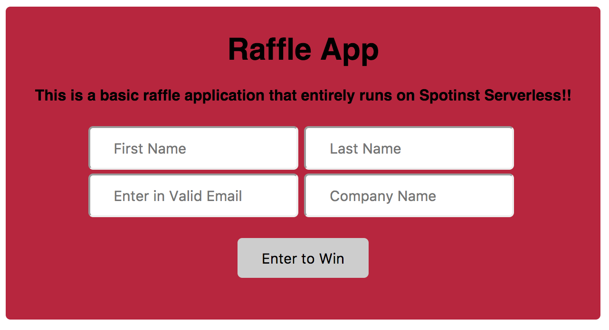

# Simple Node Map Reduce

[Check Out the Code](https://github.com/spotinst/spotinst-functions-examples/tree/master/node-map-reduce)



This application is a basic implimentation of Map Reduce. It first will generate a random JSON of key value pairs where the keys range from 1-4 and the values range 1-13. Then this JSON is passed to the splitter that will split it into chunks of 10 values and pass each one into a Mapper. The Mapper then breaks each chunk by key and sends all the pairs with the same key to a Reducer. The Reducer will add up all the numbers with the same key then send back the result. The output is four key value pairs that are the sum of all the values that have the same key.

## Download

To download this project as a template for your own Spotinst Function please use this command

```bash
serverless create --template-url https://github.com/spotinst/spotinst-functions-examples/tree/master/node-map-reduce
```


### Prerequisites

You will need to have the serverless framework installed, your Spotinst credentials set up and you will need your environment ID and account ID in order to run this project. 

First you will want to install the serverless framework onto your local machine using the terminal command

```bash
npm install -g serverless
```

Once this has finished downloading you will have to set up your credentials to link your local machine projects to your Spotinst console. To do this please follow the directions listed [here](https://serverless.com/framework/docs/providers/spotinst/guide/credentials/).

You will also need your environment ID for your function. This can be found on the Spotinst console under the Serverless Functions tab. Select the application you wish to deploy this funciton to and locate the environment that you wish to use. Copy the environment ID and save this for later use

The last thing you will need is your account ID which can be found in the Spotinst console under user setting. Save this for later use. 

### Installing

First you will need to fork this repository and set it up on your local machine. Then you will need to install the serverless-spotinst-functions plugin and the mysql library by running this command inside the project repository:

```bash
npm install
```

Once this has been completed you will need to navigate to the serverless.yml file and under environment add in the environment ID in the environment section.

## Deployment

Next you will want to deploy this function using this command:

```bash
sls deploy
```

The first time you run this command your new function will be created and linked to your Spotinst account under the environment that you specified. You can check this on the Spotinst Functions console. 

## Testing

To test if this is working use the command:

```bash
sls invoke -f Generator
```

Or you can use the test feature on the Spoinst console. 

## Testing

When you run this function you will have to run Generator to get the input for the Splitter function. Or you could pass in your own JSON into Splitter as long as it is in the format of key value pairs where the keys are 1-4. The output for the total sum can be found in the logs of the Splitter function

## Environment Variables

After the project has been deployed you will need to enter the number of key/value inputs that you want to go through the function as an environment variable. Right now it is set to 100 but you can change that through the console. For the Generator function

**Warning:** If you edit your code then re-deploy the function your environment variables will get over written. To stop this from happening delete the list of environment variables from the `serverless.yml` file after the first deploy
