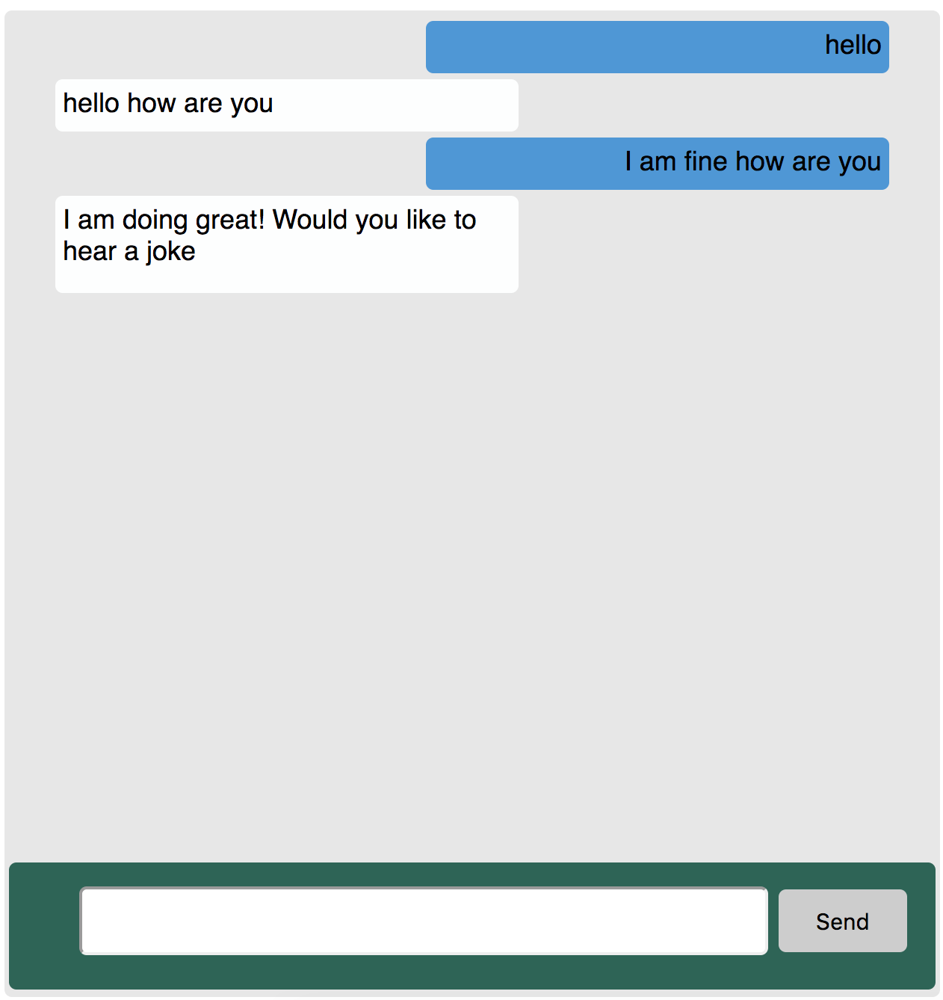

# Simple Node Chatbot

[Check Out the Code](https://github.com/spotinst/spotinst-functions-examples/tree/master/node-simple-chatbot)



This porject will simulate a basic chatbot. The user will be able to enter messages and the bot will check if there is a response to the exact input from the user. If the user does not enter the exact input then the bot will respond with "I dont have an answer for that". If you want to input your own message go to the `memory.js` file and alter it for your needs. 

## Download

To download this project as a template for your own Spotinst Function please use this command

```bash
serverless create --template-url https://github.com/spotinst/spotinst-functions-examples/tree/master/node-simple-chatbot
```


### Prerequisites

You will need to have the serverless framework installed, your Spotinst credentials set up and you will need MySQL database credentials, environment ID and account ID in order to run this project. 

First you will want to install the serverless framework onto your local machine using the terminal command

```bash
npm install -g serverless
```

Once this has finished downloading you will have to set up your credentials to link your local machine projects to your Spotinst console. To do this please follow the directions listed [here](https://serverless.com/framework/docs/providers/spotinst/guide/credentials/).

You will also need your environment ID for your function. This can be found on the Spotinst console under the Serverless Functions tab. Select the application you wish to deploy this funciton to and locate the environment that you wish to use. Copy the environment ID and save this for later use

Additionally you will need to have your MySQL `host`, `username`, `database`, and `password` to gain access to your data table.

The last thing you will need is your account ID which can be found in the Spotinst console under user setting. Save this for later use. 

### Installing

First you will need to fork this repository and set it up on your local machine. Then you will need to install the serverless-spotinst-functions plugin and the mysql library by running this command inside the project repository:

```bash
npm install
```

Once this has been completed navigate to the handler.js file and input your MySQL credentials. Then you will need to navigate to the serverless.yml file and under environment add in the environment ID in the environment section.

## Deployment

Next you will want to deploy this function using this command:

```bash
sls deploy
```

The first time you run this command your new function will be created and linked to your Spotinst account under the environment that you specified. You can check this on the Spotinst Functions console. 

## Testing

To test if this is working you will have to find the the URL that was created when you deploy your fuction. Under Service Information you will see the name of the function BasicChatBot. Under this heading you should see id, version and URL. Copy the URL and paste it into your favorite browser.

Another way to find the URL is to go to your Spotinst console and navigate to the environment where this function is located. Here you will see the function name and URL. Copy this and paste it into your favorite browser.

**Note** Serverless functions do take time to be injected into their containers right after a deploy is fired so be patient if it does not show up right away

## Personalizing

If you are looking to alter this chat bot to response to your personal inputs, or you simply want more options for your bot to respond to, go to the memory.js file and add responses as needed. The format is in JSON with what the user says on the left and how the bot responds on the right. 

